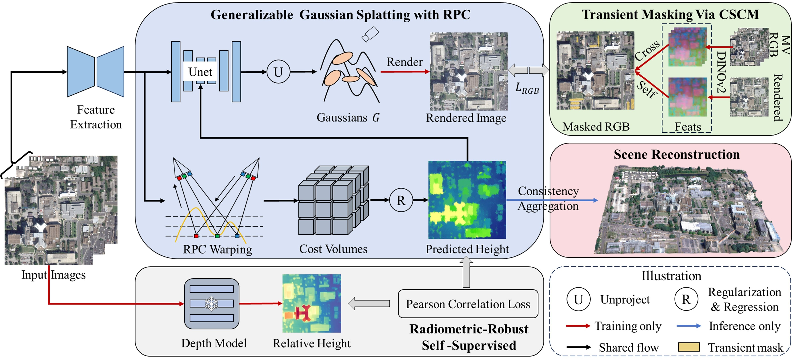
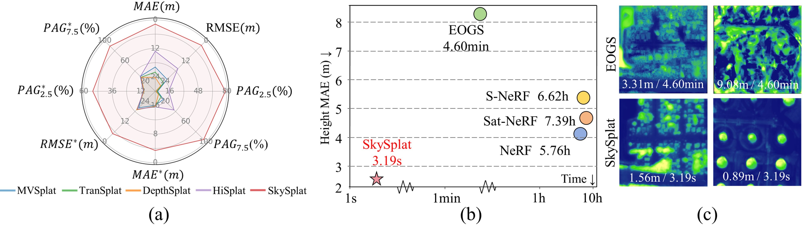

# SkySplat


This repository provides the implementation of SkySplat, a 3D Gaussian Splatting framework for sparse-view satellite image reconstruction.
SkySplat has been accepted by AAAI 2026.

## ✨ Overview

SkySplat addresses multi-temporal sparse-view satellite reconstruction by integrating the RPC camera model into a generalizable 3D Gaussian Splatting pipeline.

<p align="center">  </p>

## 🚀 Key Features
- **RPC-aware 3D Gaussian Splatting** for satellite-specific geometric modeling.
 
- **Self-supervised learning** with radiometric-robust relative height supervision (no ground-truth labels required)
 
- **Efficient inference**, achieving up to 86× speedup over per-scene optimization methods (e.g., EOGS)

## 📊 Results
<p align="center">  </p>

- **Strong performanceDFC19**: MAE reduced from 13.18 m → 1.80 m with 3.19s!

- **Strong generalization**: consistent performance on MVS3D benchmark

## ⚙️ Setup
1. Dataset configuration

Before training, modify the dataset path in:

config/experiment/re10k.yaml

Update:

dataset:
  roots: /path/to/your/dataset
  
## 🏋️ Training

Run training with:

CUDA_VISIBLE_DEVICES=0 python -m src.main +experiment=re10k data_loader.train.batch_size=1

## 🚀 Inference / Testing

Run evaluation on a trained checkpoint:

CUDA_VISIBLE_DEVICES=0 python -m src.main +experiment=re10k checkpointing.load=Path_ckpt mode=test
🛰️ RPC Camera Processing (Important)

SkySplat relies on RPC camera models for satellite image geometry.

To convert RPC imagery into pinhole-style camera representations, we follow the pipeline from:

👉 https://github.com/Kai-46/SatelliteSfM

This process generates:

dataset/
├── cameras/
├── cameras_others/

These camera files are required for training and inference.

## 📐 Optional: Depth Projection

If depth maps need to be generated from height maps, projection can be performed using camera geometry from the RPC-to-pinhole conversion step.


## 💳 Citation

If your work uses all or part of this code, please cite:
```
@inproceedings{huang2026skysplat,
  title={SkySplat: Generalizable 3D Gaussian splatting from multi-temporal sparse satellite images},
  author={Huang, Xuejun and Liu, Xinyi and Wan, Yi and Zheng, Zhi and Zhang, Bin and Xiong, Mingtao and Pei, Yingying and Zhang, Yongjun},
  booktitle={Proceedings of the AAAI Conference on Artificial Intelligence},
  volume={40},
  number={7},
  pages={5158--5166},
  year={2026}
}
```

You can find our [paper on AAAI2026 and arxiv 📄](https://ojs.aaai.org/index.php/AAAI/article/view/37430).
